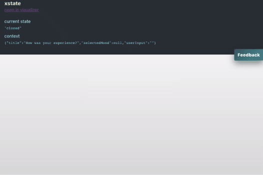

# Exploring xstate with React
Exploring [xstate](https://xstate.js.org/) to model a simple feedback form with animations. A declarative way to model 
state, state-transitions and side effects. What events are allowed in each state that drives the state transitions
and what side effects should occur and when.

Uses fake api requests for submitting, it fails 30% of the time to trigger retry logic. With xstate state machine can 
be visualised, this projects machine can be found 
[here](https://xstate.js.org/viz/?gist=9e21664f13105e923c66bfb7872c87e3).

