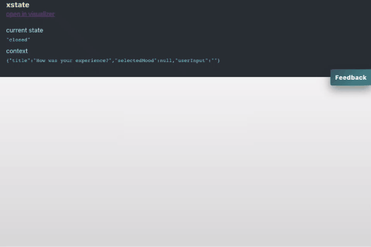

# Exploring xstate with React

Exploring [xstate](https://xstate.js.org/) to model a simple feedback form with animations. A declarative way to model
state, state-transitions and side effects. What events are allowed in each state that drives the state transitions
and what side effects should occur and when.

> [!NOTE]
> The original interactive example is no longer available on the link below. You will be redirected to stately.ai where new state machines can be created. I'm keeping the project mostly as is - archived / historical reference.



Uses fake api requests for submitting, it fails 30% of the time to trigger retry logic. With xstate state machine can
be visualised, this projects machine can be found
[here](https://xstate.js.org/viz/?gist=9e21664f13105e923c66bfb7872c87e3) (old link, no longer works, just kept for reference)


## Running locally

```bash
npm install
npm start
```

Additional scripts:

```bash
npm run build
npm test
```
